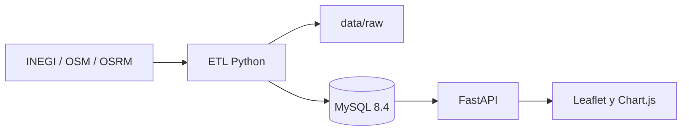

# Arquitectura

```mermaid
flowchart LR
 fuentes[INEGI / OSM / OSRM] --> etl[ETL Python]
 etl --> raw[data/raw]
 etl --> dw[(MySQL 8.4)]
 dw --> api[FastAPI]
 api --> web[Leaflet y Chart.js]
```

En despliegue cloud, `data/raw` equivale a S3, MySQL a RDS, el workflow a EventBridge/Lambda y la API a ECS/App Runner.
